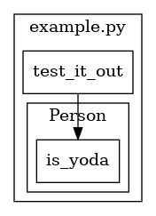

# Pyrser
A simple tool to visualize function calls in Python modules

### Example
Using the simple ``example.py`` file below:
```python
class Person:
    
    def __init__(self, name, age):
        self.name = name
        self.age = age

    def is_yoda(self):
        if self.age < 500:
            print("Probably not Yoda")
        else:
            print("Quite possibly Yoda")


def test_it_out():
    p = Person("Kyle", 27)
    p.is_yoda()
```

```
from Pyrser import pyrser

graph = pyrser("example.py")

graph
FileNode(name='example.py', scope=[1, 16], location=/path/to/example.py)
 |-- ClsNode(name='Person', scope=[1, 11])
 |    |-- FncNode(name='is_yoda', scope=[7, 11], calls=[])
 |-- FncNode(name='test_it_out', scope=[14, 16], calls=['Person', 'is_yoda'])
```

Pyser creates a simple graph with `children` and `parent` attributes for each node that allow you to traverse the graph in either direction from wherever you are. Additionally, `scope` describes the lines each node encompasses (for example, ``test_it_out`` is defined from line 14 to 16 in ``example.py``) The presence of the instantiation call to ``Person`` is an open issue. There is functionality in the works to produce a graphviz representation of this graph, which would generate an image like below:



### Where are we at?
So far, we have the basic groundwork completed:
- Ability to serialize a .py file into a custom graph
- Ability to visualize a .py file's calls with graphviz (but ONLY for functions defined in the same file)

### Where are we going (aka, wish list)
- readthedocs sphinx documentation
- Simple webserver to server the graphviz as html
- In the distant future, a D3js representation of the graphviz output to allow users to click on functions and see the actual source code
